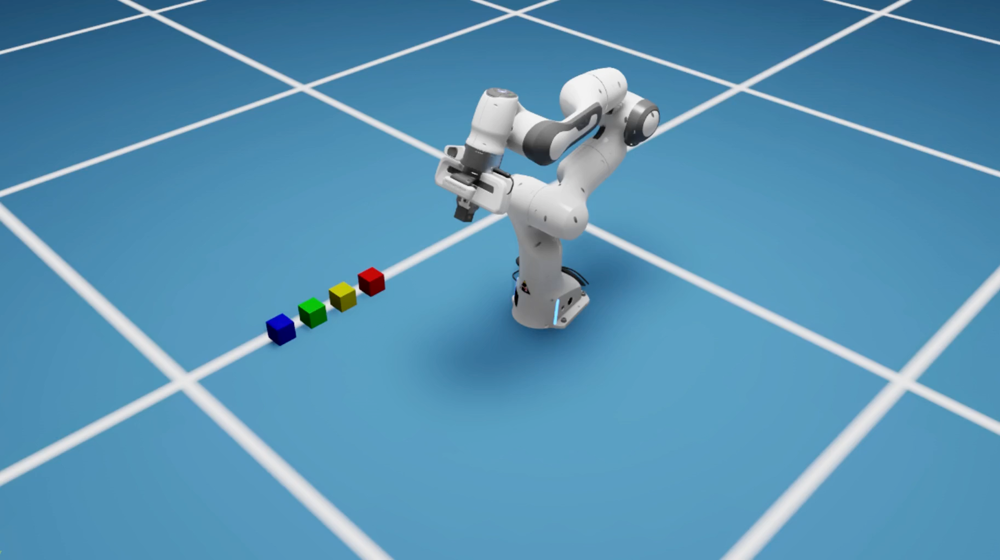

# Robot Arm Manipulation with Reinforcement Learning

> Training a Franka Panda robot arm to perform pick-and-place tasks using Deep Reinforcement Learning and Isaac Sim


*Franka Panda robot performing pick-and-place manipulation in NVIDIA Isaac Sim*

## Project Overview

This project demonstrates end-to-end implementation of robotic manipulation using modern RL techniques. A **Franka Panda 7-DOF robot arm** learns to autonomously grasp, lift, and precisely place objects through **Proximal Policy Optimization (PPO)** in a GPU-accelerated physics simulation.

### Key Achievements

- **Custom RL Environment**: Extended IsaacLab framework with custom task configurations and reward shaping
- **Advanced Control**: Implemented Inverse Kinematics with relative pose control for intuitive manipulation
- **Efficient Training**: Massively parallel simulation (4096+ environments) achieving convergent policies in ~30-45 minutes
- **Custom Task Variant**: Developed `OnTable` placement task variant with modified reward structure for practical tabletop manipulation

## Technical Stack

**Robotics & Simulation**
- NVIDIA Isaac Sim / IsaacLab - GPU-accelerated physics simulation
- Franka Panda robot (7-DOF arm + parallel gripper)
- Inverse Kinematics (Damped Least Squares solver)

**Machine Learning**
- Reinforcement Learning: Proximal Policy Optimization (PPO)
- Framework: RSL-RL (Robotic Systems Lab)
- PyTorch backend with CUDA acceleration
- Gymnasium API for environment interfacing

**Engineering**
- Python development with modular configuration system
- Parallel environment scaling (tested up to 4096 environments)
- Training orchestration with checkpoint management
- Shell scripting for workflow automation

## Core Capabilities

The trained agent demonstrates:

1. **Precise Reaching** - Navigates 7-DOF arm to approach target objects
2. **Adaptive Grasping** - Controls parallel gripper with force feedback
3. **Smooth Lifting** - Maintains stable grasp while overcoming gravity
4. **Goal-Oriented Placement** - Transports object to target pose with millimeter precision
5. **Robust Generalization** - Handles varying object positions and goal locations

## Project Architecture

```
robot_arm/
├── lift_task/                      # Custom task implementation
│   ├── config/franka/
│   │   ├── ik_rel_env_cfg.py      # IK relative control (primary)
│   │   ├── ik_abs_env_cfg.py      # IK absolute control variant
│   │   ├── joint_pos_env_cfg.py   # Joint-level control variant
│   │   └── agents/rsl_rl_ppo_cfg.py
│   ├── lift_env_cfg.py            # Base environment configuration
│   └── mdp/                        # MDP components
│       ├── observations.py         # State representation
│       ├── rewards.py              # Reward function design
│       └── terminations.py         # Episode termination logic
├── train_robot_arm.py             # Main training script
├── run_training.sh                # Training orchestration
└── play_trained_policy.sh         # Policy evaluation/visualization
```

## Quick Start

### Training

```bash
# Quick training test (5-10 minutes)
./run_training.sh --num_envs 512 --max_iterations 1000 --headless

# Full training for deployment-ready policy (30-45 minutes)
./run_training.sh --num_envs 4096 --max_iterations 5000 --headless

# Resume from checkpoint
./run_training.sh --num_envs 4096 --max_iterations 10000 --resume --headless
```

### Evaluation

```bash
# Visualize trained policy
./play_trained_policy.sh

# Use specific checkpoint
./play_trained_policy.sh --checkpoint logs/rsl_rl/.../model_5000.pt
```

## Technical Deep Dive

### Reward Engineering

Carefully designed reward function balancing multiple objectives:

| Component | Weight | Purpose |
|-----------|--------|---------|
| `reaching_object` | 1.0 | Dense reward for approaching cube |
| `lifting_object` | 15.0 | Sparse bonus for successful grasp and lift |
| `object_goal_tracking` | 16.0 | Primary placement objective |
| `object_goal_tracking_fine_grained` | 5.0 | Precision placement refinement |
| `action_rate` | -1e-4 | Smoothness regularization |
| `joint_vel` | -1e-4 | Energy efficiency penalty |

### Control Architecture

**Inverse Kinematics Control**
- End-effector pose commands (position + orientation)
- Relative mode: Actions are deltas, not absolute targets
- Damped Least Squares IK solver for numerical stability
- Action scaling: 0.5 for smooth, stable movements

**Gripper Control**
- Binary action space (open/close)
- Position control: 0mm (closed) to 40mm (open)
- Synchronized with arm commands for coordinated manipulation

### Observation Space

State representation includes:
- Joint positions (7-DOF, relative to home)
- Joint velocities (7-DOF)
- Object pose (position + orientation in robot frame)
- Goal pose (target location for object)
- Previous actions (temporal information for smoothness)

### Training Performance

**Scaling**
- Single GPU training: RTX 3090 / A100
- Parallel environments: 512 - 4096 simultaneous simulations
- Throughput: ~50,000 environment steps/second

**Learning Progression**
1. **0-1000 iter**: Reaching behavior emerges
2. **1000-3000 iter**: Successful grasping develops
3. **3000-5000 iter**: Lifting and transport coordination
4. **5000+ iter**: Precise placement and fine-tuning

## Skills Demonstrated

This project showcases expertise in:

**Robotics**
- Manipulation task design and implementation
- Kinematics and control theory (FK/IK)
- Gripper mechanics and contact dynamics
- Robot simulation and digital twins

**Machine Learning**
- Deep Reinforcement Learning (PPO algorithm)
- Reward shaping and curriculum learning
- Hyperparameter tuning and training optimization
- Policy evaluation and transfer

**Software Engineering**
- Python development with clean architecture
- Configuration management and modularity
- GPU computing and parallel processing
- Reproducible research practices
- Shell scripting and automation

**Research & Problem Solving**
- Literature review and implementation of state-of-the-art methods
- Systematic experimentation and debugging
- Performance optimization and scaling
- Documentation and knowledge transfer

## Available Task Variants

| Task ID | Description | Control Type |
|---------|-------------|--------------|
| `Isaac-Lift-Cube-Franka-IK-Rel-v0` | Pick and place (mid-air goal) | IK Relative |
| `Isaac-Lift-Cube-Franka-IK-Rel-OnTable-v0` | **Pick and place (tabletop)** ⭐ | IK Relative |
| `Isaac-Lift-Cube-Franka-IK-Abs-v0` | Pick and place (absolute IK) | IK Absolute |
| `Isaac-Lift-Cube-Franka-v0` | Pick and place (joint control) | Joint Position |

## Future Enhancements

Potential extensions demonstrating continued growth:

- Multi-object manipulation and sorting tasks
- Sim-to-real transfer with domain randomization
- Vision-based policies (RGB-D input)
- Contact-rich manipulation (insertion, assembly)
- Human-robot collaboration scenarios
- Deployment on physical Franka hardware

## Contact & Collaboration

Interested in robotics, machine learning, or this project? Let's connect:

- **GitHub**: [Your GitHub Profile]
- **LinkedIn**: [Your LinkedIn]
- **Email**: [Your Email]

Open to opportunities in: Robotics Engineering, ML/AI Research, Autonomous Systems, Simulation & Digital Twins

---

**Technical Documentation**: See [readme.txt](readme.txt) for detailed configuration and implementation notes.
